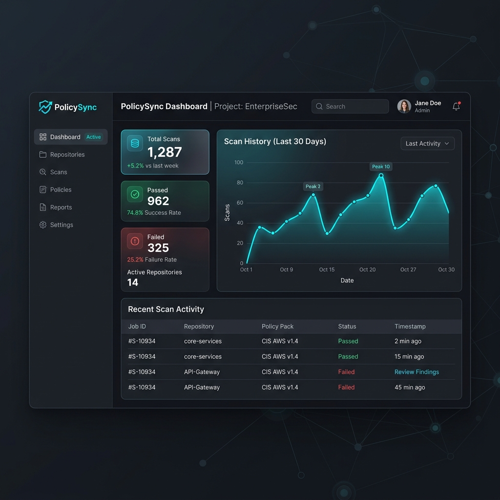

# PolicySync – Policy as Code Security Enforcement Platform

PolicySync is a full-stack, enterprise-grade Policy as Code (PaC) security enforcement platform. It automatically scans cloud infrastructure configurations (Infrastructure as Code - IaC) against a defined library of security rules, identifying violations and blocking unsafe deployments in the CI/CD pipeline before they reach production.

[](https://jithun02.github.io/CLOUD-GAURD/overview)

---

## 🚀 Key Features

*   **Dual-Engine Security Scanner**: Uses a fast, zero-dependency custom RegEx scanning engine coupled with a fallback hook to **Checkov** for over 1,000+ community policies.
*   **18 Built-in Security Policies**: Enforces essential best practices across AWS, GCP, Azure, and Kubernetes:
    *   *AWS*: Credentials leaks (CRITICAL), public S3 buckets (CRITICAL), open security groups (HIGH), wildcard IAM policies (HIGH), public RDS (HIGH), hardcoded passwords (CRITICAL), disabled encryption (MEDIUM), disabled CloudTrail (MEDIUM).
    *   *GCP*: Open firewalls (CRITICAL), public storage buckets (CRITICAL), database public IP (HIGH), disabled logging (MEDIUM).
    *   *Azure*: Non-HTTPS storage (HIGH), public container blobs (CRITICAL), open SQL firewall rules (HIGH).
    *   *Kubernetes*: Containers running as root (HIGH), privileged containers (CRITICAL), plaintext secrets in environment variables (HIGH).
*   **9-Page Real-time Dashboard**:
    *   *Overview*: Key metrics, line charts of scan histories, donut charts of severity ratios, recent logs, and top-failed rules.
    *   *Scanner*: Paste raw configurations to test on the spot.
    *   *Policies*: Searchable and filterable database of detailed remediation guides.
    *   *Pipeline*: Interactive animated CI/CD deployment simulator.
    *   *History*: Log audit page for all manual and webhook-triggered runs.
    *   *Editor*: Built-in Web IDE to code and validate configurations side-by-side.
    *   *Terminal*: Web-based terminal shell simulator.
    *   *Reports*: Regulatory radars (CIS, NIST, SOC 2, GDPR) with PDF exporting.
    *   *Settings*: Severity block threshold configurator and webhook URL setup.
*   **Standalone CLI Utility**: Embeddable `policy_check.py` script that returns standard exit codes (`0` for clean, `1` for violations) for pipeline checks.
*   **Prometheus Metrics Exporter**: Telemetry metrics exposed natively at `/metrics` for Prometheus scraping.

---

## 🔄 Project Module Workflow

The platform bridges the gap between development speed and cloud compliance with an automated webhook and pipeline workflow:

```
[ Developer ] ───> writes IaC (.tf / .yaml)
     │
     └───> git push ───> [ GitHub Actions / Webhook ]
                              │
                              ▼
                       [ policy_check.py ]
                              │
             ┌────────────────┴────────────────┐
             ▼ (Violations Detected)           ▼ (Clean Scan)
       [ Exit Code 1 ]                   [ Exit Code 0 ]
             │                                 │
             ▼                                 ▼
   [ Pipeline Blocked ]               [ Auto-Deployed ]
```

### Module Breakdown

1.  **Scanner Engine (`backend/scanner.py` & `backend/policies_data.py`)**: Runs line-by-line regex pattern matching, calculates severities, and isolates violation contexts.
2.  **REST API Service (`backend/main.py`)**: Exposes FastAPI endpoints for scans, stats, histories, webhooks, and handles Prometheus telemetry counters.
3.  **Client Dashboard (`frontend/`)**: Renders interactive Next.js views with live analytics.

---

## 🛠 How to Run the Project

Ensure you have **Git**, **Node.js (v20+)**, and **Python (v3.12)** or **Docker** installed.

### Method 1: One-Command Startup (Using Docker Compose)

The easiest way to start both the Next.js frontend (port 3000) and the FastAPI backend (port 8000) is using the pre-configured orchestration script:

1.  Clone the repository:
    ```bash
    git clone https://github.com/yourusername/policysync.git
    cd policysync
    ```
2.  Launch the services:
    ```bash
    ./start.sh
    ```
    *If Docker is running on your system, it will automatically build and start the containers. Otherwise, it will launch them in local python/next dev servers.*

### Method 2: Manual Local Launch (Without Docker)

If you prefer to run services manually for local development:

#### 1. Start the Backend API
```bash
cd backend
python3 -m venv venv
source venv/bin/activate
pip install -r requirements.txt
python3 -m uvicorn main:app --host 0.0.0.0 --port 8000
```
*The API is now running on `http://localhost:8000` with documentation active at `http://localhost:8000/docs`.*

#### 2. Start the Next.js Dashboard
```bash
cd frontend
npm install
npm run dev
```
*The dashboard is now running at `http://localhost:3000`.*

---

## 🧪 Local Testing via CLI Scanner

You can test the standalone CLI scanner tool against the provided infrastructure templates directly in your terminal:

```bash
# Scan a misconfigured Terraform file (should detect 6 violations and return Exit Code 1)
./policy_check.py scan demo-infra/infra/main.tf

# Scan a secure/compliant Terraform file (should return 0 violations and return Exit Code 0)
./policy_check.py scan demo-infra/infra/main-fixed.tf
```
